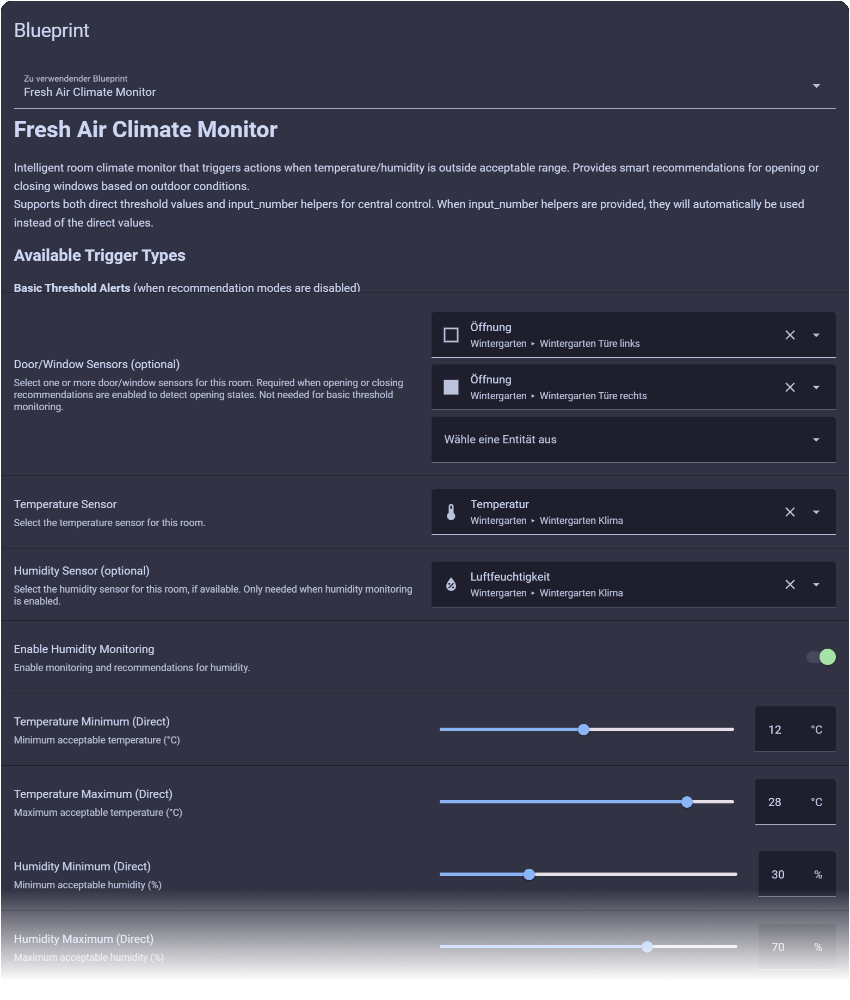

# Fresh Air Climate Monitor

> **Current Version: 1.2.1**

A comprehensive Home Assistant blueprint that provides intelligent climate control through both active monitoring and proactive recommendations for optimal fresh air management.

[](https://my.home-assistant.io/redirect/blueprint_import/?blueprint_url=https%3A//raw.githubusercontent.com/EarMaster/home-assistant-freshair-climate-monitor/main/freshair-climate-monitor.yaml)

## 🌟 Features

- **Proactive Outdoor Analysis**: Recommends opening/closing when outdoor conditions are better/worse than inside
- **Window State Change Detection**: Triggers when windows open/close and optimal climate is achieved
- **Clear Notification Support**: Detects optimal conditions for clearing alerts or restarting AC
- **Flexible Threshold Configuration**: Use direct values or input_number helpers for centralized control
- **Multiple Opening Support**: Monitor multiple doors and windows per room
- **Rich Action Context**: Detailed variables for sophisticated automation responses
- **Optional Actions**: Set up monitoring first, add actions later - no actions required initially
- **Robust Error Handling**: Graceful handling of sensor unavailability and edge cases



## 🧠 Intelligent Operation Modes

### Combined Mode (Recommended)
The blueprint automatically operates in both modes simultaneously:

**Climate Management** (when openings are open):
- Monitor temperature and humidity thresholds
- Take action when conditions exceed acceptable ranges
- Provide context about current ventilation status

**Opening Recommendations** (when openings are closed):
- Compare indoor vs outdoor conditions
- Suggest opening when outdoor air would improve indoor climate
- Calculate optimal timing for natural climate control

### Individual Mode Control
You can also enable/disable each function independently:
- **Opening Recommendations only**: Smart suggestions when to open windows/doors
- **Closing Recommendations only**: Smart suggestions when to close windows/doors  
- **Both enabled**: Full intelligent climate assistance
- **Neither enabled**: Basic threshold monitoring without recommendations

## 🎯 Trigger IDs and Their Meanings

The blueprint uses specific trigger IDs to identify different climate scenarios. Understanding these helps you create more targeted actions:

### Basic Threshold Triggers
These activate when **both recommendation modes are disabled** for simple monitoring:

| Trigger ID | Condition | When It Fires |
|------------|-----------|---------------|
| `threshold_temp_high` | Temperature above maximum | Simple alert when too hot |
| `threshold_temp_low` | Temperature below minimum | Simple alert when too cold |
| `threshold_humidity_high` | Humidity above maximum | Simple alert when too humid |
| `threshold_humidity_low` | Humidity below minimum | Simple alert when too dry |

### Opening Recommendation Triggers
These activate when **openings are closed** and outdoor conditions could help:

| Trigger ID | Condition | When It Fires |
|------------|-----------|---------------|
| `open_temp_high` | Room too hot, outside cooler | Recommend opening for natural cooling |
| `open_temp_low` | Room too cold, outside warmer | Recommend opening for natural warming |
| `open_humidity_high` | Room too humid, outside drier | Recommend opening for dehumidifying |
| `open_humidity_low` | Room too dry, outside more humid | Recommend opening for humidifying |

### Closing Recommendation Triggers
These activate when **openings are open** but outdoor conditions are worse than indoor:

| Trigger ID | Condition | When It Fires |
|------------|-----------|---------------|
| `close_temp_high` | Room too hot, outside even hotter | Recommend closing for better cooling |
| `close_temp_low` | Room too cold, outside even colder | Recommend closing for better warming |
| `close_humidity_high` | Room too humid, outside even more humid | Recommend closing for better dehumidifying |
| `close_humidity_low` | Room too dry, outside even drier | Recommend closing for better humidifying |

### Window State Change Triggers
These activate when **windows/doors change state** and optimal conditions are achieved:

| Trigger ID | Condition | When It Fires |
|------------|-----------|---------------|
| `window_opened` | Window/door opened and helps climate | When opening improves temperature or humidity |
| `window_closed` | Window/door closed and helps climate | When closing improves temperature or humidity |
| `clear` | Optimal climate conditions achieved | Use to clear notifications or restart AC |

### Quick Reference
```yaml
# In your actions, use trigger.id to determine the scenario:
- condition: template
  value_template: "{{ trigger.id.startswith('threshold_') }}"  # Basic threshold alerts
- condition: template
  value_template: "{{ trigger.id.startswith('open_') }}"  # Any opening recommendation
- condition: template
  value_template: "{{ trigger.id.startswith('close_') }}"  # Any closing recommendation
- condition: template
  value_template: "{{ trigger.id == 'window_opened' }}"  # Window opened and helps climate
- condition: template
  value_template: "{{ trigger.id == 'window_closed' }}"  # Window closed and helps climate
- condition: template
  value_template: "{{ trigger.id == 'clear' }}"  # Optimal conditions achieved
- condition: template
  value_template: "{{ trigger.id == 'open_temp_high' }}"  # Specific cooling opportunity
- condition: template
  value_template: "{{ 'temp' in trigger.id }}"  # Any temperature-related trigger
- condition: template
  value_template: "{{ 'humidity' in trigger.id }}"  # Any humidity-related trigger
```

## 📱 Example Actions

**Note**: Actions are completely optional! You can set up the blueprint without any actions initially, then add them later as needed. The blueprint will monitor your climate conditions and provide all the trigger information without requiring any specific responses.

### Comprehensive Notification System

**To use this example**: Replace `notify.mobile_app_your_phone` with your actual notification service (e.g., `notify.mobile_app_johns_iphone` or `notify.persistent_notification`).

```
action:
  - choose:
      # Basic threshold alerts (simple monitoring mode)
      - alias: "Threshold Alerts"
        conditions:
          - condition: template
            value_template: "{{ trigger.id.startswith('threshold_') }}"
        sequence:
          - service: notify.mobile_app_your_phone
            data:
              title: "🌡️ Climate Alert: {{ room_name }}"
              message: >
                
                  🔥 Temperature is high: {{ current_temperature }}°C (Max: {{ temp_max }}°C)
                  💡 Consider your cooling options or check ventilation
                
                  🧊 Temperature is low: {{ current_temperature }}°C (Min: {{ temp_min }}°C)
                  💡 Consider your heating options or close windows
                
                  💧 Humidity is high: {{ current_humidity }}% (Max: {{ humidity_max }}%)
                  💡 Consider dehumidification or improving air circulation
                
                  🏜️ Humidity is low: {{ current_humidity }}% (Min: {{ humidity_min }}%)
                  💡 Consider humidification or reducing air circulation
                
              data:
                channel: "Fresh Air Climate Monitor"
                notification_icon: "mdi:thermometer-alert"
                tag: "climate_{{ room_name | lower | replace(' ', '_') }}"

      # Opening recommendations when all doors/windows closed
      - alias: "Opening Recommendations"
        conditions:
          - condition: template
            value_template: "{{ trigger.id.startswith('open_') }}"
        sequence:
          - service: notify.mobile_app_your_phone
            data:
              title: "💨 Fresh Air Opportunity: {{ room_name }}"
              message: >
                
                  🌡️ Time to open windows for natural cooling!
                  Outside: {{ outdoor_temperature }}°C ({{ temperature_difference | abs }}°C cooler)
                  Inside: {{ current_temperature }}°C ({{ temp_max }}°C max)
                  💡 Opening windows could naturally cool your room!
                
                  ☀️ Great time to open windows for natural warming!
                  Outside: {{ outdoor_temperature }}°C ({{ temperature_difference }}°C warmer)
                  Inside: {{ current_temperature }}°C ({{ temp_min }}°C min)
                  💡 Let the sunshine help warm your space!
                
                  💧 Open windows to reduce humidity naturally!
                  Outside: {{ outdoor_humidity }}% ({{ humidity_difference | abs }}% drier)
                  Inside: {{ current_humidity }}% ({{ humidity_max }}% max)
                  💡 Fresh air circulation can help reduce moisture!
                
                  🌿 Outdoor air can help increase indoor humidity!
                  Outside: {{ outdoor_humidity }}% ({{ humidity_difference }}% more humid)
                  Inside: {{ current_humidity }}% ({{ humidity_min }}% min)
                  💡 Natural moisture from outside air could help!
                
              data:
                channel: "Fresh Air Climate Monitor"
                notification_icon: "mdi:window-open"
                tag: "climate_{{ room_name | lower | replace(' ', '_') }}"

      # Climate management when doors/windows are open
      - alias: "Closing Recommendations"
        conditions:
          - condition: template
            value_template: "{{ trigger.id.startswith('close_') }}"
        sequence:
          - service: notify.mobile_app_your_phone
            data:
              title: "🌡️ Climate Management: {{ room_name }}"
              message: >
                
                  🔥 Time to close windows to prevent overheating!
                  Outside: {{ outdoor_temperature }}°C ({{ temperature_difference }}°C hotter)
                  Inside: {{ current_temperature }}°C ({{ temp_max }}°C max)
                  💡 Closing windows could prevent more heat from entering!
                
                  🧊 Time to close windows to retain warmth!
                  Outside: {{ outdoor_temperature }}°C ({{ temperature_difference | abs }}°C colder)
                  Inside: {{ current_temperature }}°C ({{ temp_min }}°C min)
                  💡 Closing windows could prevent heat loss!
                
                  💧 Close windows to prevent excess moisture!
                  Outside: {{ outdoor_humidity }}% ({{ humidity_difference }}% more humid)
                  Inside: {{ current_humidity }}% ({{ humidity_max }}% max)
                  💡 Outdoor air would add unwanted moisture!
                
                  🏜️ Close windows to retain indoor moisture!
                  Outside: {{ outdoor_humidity }}% ({{ humidity_difference | abs }}% drier)
                  Inside: {{ current_humidity }}% ({{ humidity_min }}% min)
                  💡 Outdoor air would remove more moisture!
                
              data:
                channel: "Fresh Air Climate Monitor"
                notification_icon: "mdi:window-closed"
                tag: "climate_{{ room_name | lower | replace(' ', '_') }}"

      # Window state changes that help climate
      - alias: "Window Opened Confirmation"
        conditions:
          - condition: template
            value_template: "{{ trigger.id == 'window_opened' }}"
        sequence:
          - service: notify.mobile_app_your_phone
            data:
              title: "✅ Window Opened: {{ room_name }}"
              message: >
                Great timing! Opening this window will help improve your climate:
                
                🌡️ Natural cooling: Outside {{ outdoor_temperature }}°C vs inside {{ current_temperature }}°C
                
                ☀️ Natural warming: Outside {{ outdoor_temperature }}°C vs inside {{ current_temperature }}°C
                
                💧 Natural dehumidifying: Outside {{ outdoor_humidity }}% vs inside {{ current_humidity }}%
                
                🌿 Natural humidifying: Outside {{ outdoor_humidity }}% vs inside {{ current_humidity }}%
                
              data:
                channel: "Fresh Air Climate Monitor"
                notification_icon: "mdi:window-open-variant"
                tag: "climate_{{ room_name | lower | replace(' ', '_') }}"

      - alias: "Window Closed Confirmation"
        conditions:
          - condition: template
            value_template: "{{ trigger.id == 'window_closed' }}"
        sequence:
          - service: notify.mobile_app_your_phone
            data:
              title: "✅ Window Closed: {{ room_name }}"
              message: >
                Good choice! Closing windows will help maintain better climate:
                
                🌡️ Preventing overheating: Outside {{ outdoor_temperature }}°C vs inside {{ current_temperature }}°C
                
                🧊 Retaining warmth: Outside {{ outdoor_temperature }}°C vs inside {{ current_temperature }}°C
                
                💧 Preventing excess moisture: Outside {{ outdoor_humidity }}% vs inside {{ current_humidity }}%
                
                🏜️ Retaining moisture: Outside {{ outdoor_humidity }}% vs inside {{ current_humidity }}%
                
              data:
                channel: "Fresh Air Climate Monitor"
                notification_icon: "mdi:window-closed-variant"
                tag: "climate_{{ room_name | lower | replace(' ', '_') }}"

      # Clear notification when optimal conditions are achieved
      - alias: "Clear Notifications"
        conditions:
          - condition: template
            value_template: "{{ trigger.id == 'clear' }}"
        sequence:
          # Clear any existing climate notifications for this room
          - service: notify.mobile_app_your_phone
            data:
              message: "clear_notification"
              data:
                tag: "climate_{{ room_name | lower | replace(' ', '_') }}"
```

### Smart TTS Announcements

**To use this example**: Replace `media_player.{{ room_name | lower | replace(' ', '_') }}_speaker` with your actual media player entity (e.g., `media_player.living_room_echo` or `media_player.kitchen_google_home`).

```
action:
  - service: tts.speak
    data:
      entity_id: media_player.{{ room_name | lower | replace(' ', '_') }}_speaker
      message: >
        
          Climate tip: It's {{ outdoor_temperature }} degrees outside, 
          
            {{ temperature_difference | abs }} degrees cooler than your {{ room_name }}.
            Opening your {{ door_window_sensors | count }} windows 
            could naturally cool the room from {{ current_temperature }} to closer to your 
            {{ temp_max }} degree maximum.
          
            with {{ humidity_difference | abs }} percent lower humidity. 
            Opening windows could help reduce your indoor humidity from {{ current_humidity }} percent 
            toward your {{ humidity_max }} percent target.
          
        
          Attention: Your {{ room_name }} {{ trigger.id | replace('_', ' ') }} threshold has been reached.
          Current conditions: {{ current_value }}{{ unit }}, with {{ open_sensors_count }} opening providing fresh air.
          
            Outside conditions are worse. Consider closing windows.
          
            Outside conditions are worse. Consider closing windows.
          
        
```

### Adaptive Lighting Integration

**To use this example**: Replace `light.{{ room_name | lower | replace(' ', '_') }}_main` with your actual light entity (e.g., `light.living_room_overhead` or `light.bedroom_lamp`).

```
action:
  - choose:
      # Cooling recommendation - suggest dimming lights
      - conditions:
          - condition: template
            value_template: "{{ trigger.id == 'open_temp_high' }}"
        sequence:
          - service: light.turn_on
            target:
              entity_id: light.{{ room_name | lower | replace(' ', '_') }}_main
            data:
              brightness_pct: 30
              color_name: "blue"
          - delay:
              seconds: 3
          - service: light.turn_off
            target:
              entity_id: light.{{ room_name | lower | replace(' ', '_') }}_main

      # Warming recommendation - suggest bright warm lights
      - conditions:
          - condition: template
            value_template: "{{ trigger.id == 'open_temp_low' }}"
        sequence:
          - service: light.turn_on
            target:
              entity_id: light.{{ room_name | lower | replace(' ', '_') }}_main
            data:
              brightness_pct: 80
              color_temp: 2700
```

### Dashboard Integration with Actionable Cards

**To use this example**: Create the helper entity `input_text.climate_recommendations` in your Home Assistant configuration, or replace it with an existing input_text entity.

```
action:
  - service: input_text.set_value
    target:
      entity_id: input_text.climate_recommendations
    data:
      value: >
        
          {{ room_name }}: {{ trigger.id | replace('_', ' ') | title }} opportunity! 
          Outside {{ outdoor_temperature }}°C vs inside {{ current_temperature }}°C
        
          {{ room_name }}: {{ trigger.id | replace('_', ' ') | title }} alert - {{ current_value }}{{ unit }}
        
        
  - service: persistent_notification.create
    data:
      title: "Fresh Air Climate Monitor"
      message: >
        Room: {{ room_name }}
        Action: {{ trigger.id | replace('_', ' ') | title }}
        
        Recommendation: Open windows/doors
        Outdoor: {{ outdoor_temperature }}°C / {{ outdoor_humidity }}%
        
        Recommendation: Close windows/doors
        
        Indoor: {{ current_temperature }}°C / {{ current_humidity }}%
        Openings: {{ open_sensors_count if trigger.id.startswith('close_') else 'All closed' }}
      notification_id: "fresh_air_{{ room_name | lower | replace(' ', '_') }}"
```

## 🔄 Advanced Integration Examples

### Smart Home Ecosystem Integration

**To use this example**: Replace `climate.{{ room_name | lower | replace(' ', '_') }}` and `fan.{{ room_name | lower | replace(' ', '_') }}_ceiling` with your actual HVAC and fan entities (e.g., `climate.living_room_thermostat` and `fan.bedroom_ceiling_fan`).

```
# Integration with HVAC systems
action:
  - choose:
      - conditions:
          - condition: template
            value_template: "{{ trigger.id == 'open_temp_high' and temperature_difference | abs > 5 }}"
        sequence:
          - service: climate.turn_off
            target:
              entity_id: climate.{{ room_name | lower | replace(' ', '_') }}
          - service: notify.mobile_app_your_phone
            data:
              message: "HVAC turned off - natural cooling available via windows!"

      - conditions:
          - condition: template
            value_template: "{{ trigger.id == 'close_temp_high' and open_sensors_count > 0 }}"
        sequence:
          - service: fan.turn_on
            target:
              entity_id: fan.{{ room_name | lower | replace(' ', '_') }}_ceiling
          - service: fan.set_percentage
            target:
              entity_id: fan.{{ room_name | lower | replace(' ', '_') }}_ceiling
            data:
              percentage: "{{ ((current_temperature - temp_max) * 20) | int | abs | min(100) }}"
```

This combined approach provides the most comprehensive climate intelligence, automatically adapting to your home's current state while proactively suggesting improvements. The rich example actions demonstrate how to create sophisticated responses that integrate with your entire smart home ecosystem.
